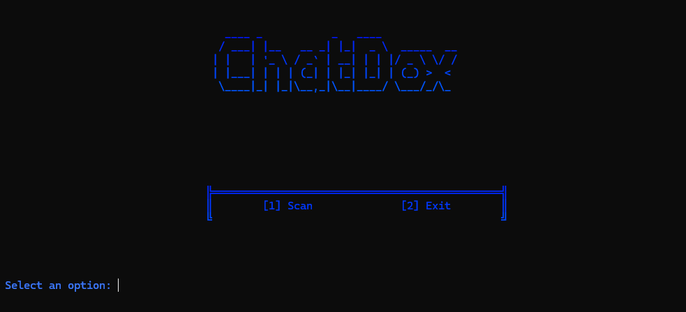

<p align=center>
  
</p>
  
```
An open source OSINT Tool!
```
<p align = "center">
  
  
  
  
  
  
  
  
  


</p>

<br>

<br>

# What is ChatDox?

- `ChatDox` is a __IP Grabbing Tool__, which is a one-stop tool peoples ip's aproximate location, and more simply by being on a call on platforms like ome.tv.

# :heavy_exclamation_mark: DISCLAIMER: 
**We do not promote any illegal or malicious activity with this tool**
**We are not responsible for anything you choose to do with this tool, and any trouble you may get into.**
<br>


## Quick Guide

> Install, Update, Usage

<br>

# :heavy_check_mark: INSTALLATION WINDOWS:
-First you need to download the zip file by clicking code and then clicking download ZIP
-Then you will also need to install WireShark, you can find the install here: https://www.wireshark.org/download.html
-Next, extract the zip file    
-Once extracted, open the extracted folder in terminal by right clicking on an empty space while in the folder, and clicking the CMD button  
-Then run

```
pip install -r requirements.txt
```
__Once the requirements have been installed, simply close out of terminal and double click the `Neptune.BAT` file__  

# :heavy_check_mark: Linux/Mac install:
-__First, make sure you have `pip` installed__  
-Then you will also need to install WireShark, you can find the install here: https://www.wireshark.org/download.html
-Then, go into terminal, and type
```
git clone https://github.com/LwkeyDev/chatdox.git  
```
__Once installed, go into the directory (CD for linux) and type__
```
pip install -r requirements.txt
``` 
Now, to run the tool, simply type  

```
python chatdox.py
```

<br>

### NOTES:

```
-  ChatDox is back with all new features and user interface
-  Please read Disclaimer before use
```

</p>


# Credits:
```
Author: Lwkey/LwkeyDev
```
